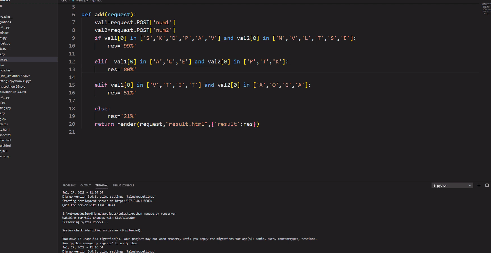

# Ratecouples
An Django based fun web for couple rating

## Getting Started
 Django is a Python-based free and open-source web framework that follows the model-template-view architectural pattern. It is maintained by the Django Software Foundation
 Here is a fun app for rating couples name 
  <a href="https://docs.djangoproject.com/en/3.0/">Start Your journey from here!</a> 
 Also if you like then Don't Forget to give a star!
🌟✨

so if You guys are intrested plese let me know clone it and became a colaborator.

## Way to help
Find me!
Git clone (using this command or download locally )
And run the command python manage.py runserver
learn few docomentation of flutter and push your code here____>>>>>>______

# Thank You :)❤️❤️
